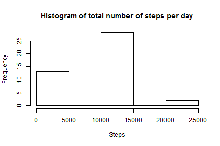
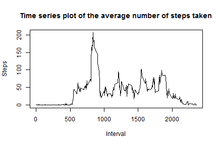
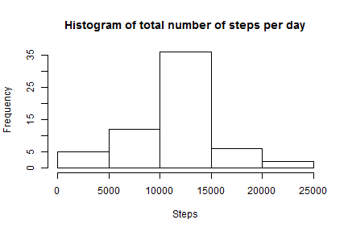
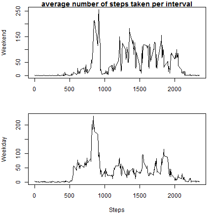

# Reproducible Research: Assignment 1

## author: Henrique

## 9 de janeiro de 2016

output: html_document

This is the report from First Assignment of Coursera's Reproducible Research.

1 - Code for reading in the dataset and/or processing the data

```r
		temp <- tempfile()
		download.file("https://d396qusza40orc.cloudfront.net/repdata%2Fdata%2Factivity.zip", temp)
		colunas <- read.table(unz(temp, "activity.csv"),na.strings = "NA",  sep = ",", header = T)
		unlink(temp)
```

2 - Histogram of the total number of steps taken each day

```r
		dados <- aggregate(colunas[ ,1], list(Y = colunas[ ,2]), sum, na.rm=TRUE)
		hist(dados[,2], main = "Histogram of total number of steps per day", xlab = "Steps")
```



3 - Calculate and report the mean and median of the total number of steps taken per day

```r
		paste("mean: ",mean(dados[,2]))
```

```
## [1] "mean:  9354.22950819672"
```

```r
		paste("median: ",median(dados[,2]))
```

```
## [1] "median:  10395"
```

4 - Time series plot of the average number of steps taken

```r
    dados <- aggregate(steps~interval , colunas, FUN=mean, na.rm=TRUE)
		plot(dados$interval, dados$steps, type="l", main="Time series plot of the average number of steps taken", ylab = "Steps", xlab = "Interval")
```



5 - The 5-minute interval that, on average, contains the maximum number of steps

```r
  paste("maximum = ",max(dados$steps), "at interval", dados[dados$step==max(dados$steps), 1])
```

```
## [1] "maximum =  206.169811320755 at interval 835"
```

6 - Code to describe and show a strategy for imputing missing data

	*I defined the Strategy to be the mean of each interval for each interval in witch the value is missing*

```r
		medias <-  aggregate(colunas[ ,1], list(Y = colunas[ ,3]), mean, na.rm=TRUE)
		colunas2<-merge(colunas, medias, by.x="interval", by.y = "Y")
		colunas2[is.na(colunas2$steps)==TRUE,2]<-colunas2[is.na(colunas2$steps)==TRUE,4]
```

7 - Histogram of the total number of steps taken each day after missing values are imputed

```r
  dados <- aggregate(colunas2[ ,2], list(Y = colunas2[ ,3]), sum, na.rm=TRUE)
		hist(dados[,2], main = "Histogram of total number of steps per day", xlab="Steps")
```



8 - Panel plot comparing the average number of steps taken per 5-minute interval across weekdays and weekends

```r
  colunas2$weekday <-  weekdays(as.Date(colunas2[,3]), abbreviate = TRUE)
		##  define if a weekday is weekend or weekday. Note that the following matrix is configured to portuguese.
		dia <- data.frame(c("dom", "seg", "ter", "qua", "qui", "sex", "sáb"),c("weekend", "weekday", "weekday", "weekday", "weekday", "weekday", "wekend"))
		names(dia)<-c("weekday", "ww")		
		colunas2<-merge(colunas2, dia, by="weekday")
		dados <- aggregate(steps~interval + ww , colunas2, FUN=mean, na.rm=TRUE)
		par(mfrow=c(2,1),mar=c(4,4,1,1))
		plot(dados[dados$ww=="wekend",1], dados[dados$ww=="wekend",3], type="l", , main = "average number of steps taken per interval", ylab="Weekend", xlab="")
		plot(dados[dados$ww=="weekday",1], dados[dados$ww=="weekday",3], type="l",ylab="Weekday", xlab="Steps")		
```



